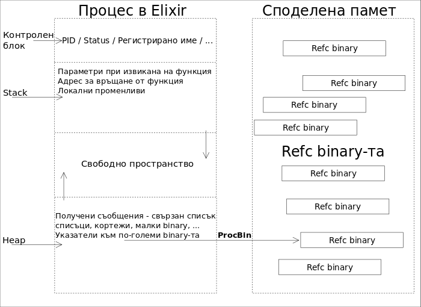

#HSLIDE
## Устройство и комуникация между процеси

#HSLIDE


#HSLIDE
## Съдържание

1. Actor модела и Elixir процесите
2. Устройство на процес
3. Процеси очакващи множество съобщения
4. Използване на receive с timeout
5. Освобождаване на паметта на процесите (GC)

#HSLIDE
## Actor модела и Elixir процесите


#HSLIDE
### Actor модел
* Всичко е Actor. Подобно на обектно-ориентираната идеология : 'всичко е обект'.   <!-- .element: class="fragment" -->
* Всеки Actor чака за съобщения. Когато получи съобщение, той може:   <!-- .element: class="fragment" -->

#HSLIDE
### Actor модел
* Да изпрати краен брой съобщения към други Actor-и.   <!-- .element: class="fragment" -->
* Да създаде краен брой нови Actor-и.   <!-- .element: class="fragment" -->
* Да определи поведение, което ще се изпълни, когато получи следващо съобщение, адресирано към него.   <!-- .element: class="fragment" -->

#HSLIDE
### Actor модел
* Тези три действия нямат определен ред и могат да са пралелни.
* Тези съобщения се предават асинхронно. <!-- .element: class="fragment" -->
* Всеки Actor си има адрес, понякога наричан пощенска кутия (mail box). <!-- .element: class="fragment" -->
* Actor-и могат да комуникират само и единствено когато знаят адресите си. <!-- .element: class="fragment" -->

#HSLIDE


#HSLIDE
### Разлики
* В Elixir не всичко е процес.
* Всяко парче код се изпълнява в процес, но типовете данни не са процеси.
* В Elixir при получаване на съобщения, кодът в самият процес е последователен.

#HSLIDE


#HSLIDE
### Прилики
* Процесите в Elixir се държат като Actor-и.

#HSLIDE
### Прилики
* Чакат за съобщения от други процеси и реагират на тях.
* При получено съобщение, могат да изпратят нови съобщения до други процеси.
* При получено съобщение, могат да създадат краен брой други процеси.
* При получено съобщение, могат да заложат поведение за следващо съобщение.

#HSLIDE
### Прилики
* Процесите в Elixir имат опашка за получените съобщения - mail box.
* Процесите в еликсир имат адреси (PID) и само процеси, знаещи адресите си могат да комуникират помежду си.

#HSLIDE
## Устройство на процес


#HSLIDE


#HSLIDE
### Контролен блок
* Тук се държи адреса на процес, PID-а.
* Състояние - дали чака или пък се изпълнява в момента.
* Възможно е да реферираме процес и по име, което също се държи тук.

#HSLIDE
```elixir
defmodule Responder do
  def run do
    Process.register(self(), :responder)

    receive do
      {pid, :ping} when is_pid(pid) ->
        send(pid, :pong)
      {pid, anything} when is_pid(pid) ->
        send(pid, "I received #{anything}.")
    end
  end
end
```

#HSLIDE
```elixir
spawn(Responder, :run, [])

send(:responder, {self(), :ping})

receive do
  :pong -> IO.puts("PONG!")
end
# PONG!
```

#HSLIDE
* Можем да видим всички регистрирани имена с Process.registered/0.

#HSLIDE
```elixir
spawn(Responder, :run, [])

:responder |> Process.whereis |> Process.info(:registered_name)
# {:registered_name, :responder}
```

#HSLIDE


#HSLIDE
### Stack
* Всеки процес си има собствен Stack.
* При създаването на процеса този стек е изключително малък, но може да расте. <!-- .element: class="fragment" -->
* Както виждате на диаграмата, докато има свободно място, stack-ът може да се разширява надолу. <!-- .element: class="fragment" -->

#HSLIDE


#HSLIDE
### Heap
* При стартиране на процеса, heap-ът му също е малък, но може да се разширява нагоре.
* Тук се намира и опашката от идващи съобщения на процеса. <!-- .element: class="fragment" -->
* Тук се пазят непроменимите структури като списъци, кортежи, както и числа с плаваща запетая, малки binary-та (под 64 байта). <!-- .element: class="fragment" -->
* За по-големите, Refc binary-а се пазят само указателите ProcBin. <!-- .element: class="fragment" -->

#HSLIDE
### Опашка от идващи съобщения


#HSLIDE
* Може да се разширява, докато има памет за това.
* В опашката са съобщенията, които процесът е получил в реда на пристигането си.  <!-- .element: class="fragment" -->
* Ако няма съобщения в опашката, receive блокира процеса и чака, докато се получи поне едно ново съобщение.  <!-- .element: class="fragment" -->

#HSLIDE
* Когато пристигне ново съобщени, то се слага в опашката.
* Когато процесът стане активен, съобщението се match-ва към условията в receive.  <!-- .element: class="fragment" -->
* Ако има успех, то се премахва от опашката.  <!-- .element: class="fragment" -->
* Ако съобщението не успее да се match-не, то се запазва за изчакване.  <!-- .element: class="fragment" -->

#HSLIDE
* Този алгоритъм се повтаря за следващото съобщение и така, докато опашката стане празна.
* В този момент изчакващите съобщения се връщат в опашката, и ще бъдат съпоставени на клаузите в receive при получаване на следващо съобщение.

#HSLIDE
* Колкото повече такива не-match-нати съобщения се застоят в опашката,
толкова по-бавен ще става receive алгоритъмът.
* Освен това те ще заемат място в паметта на процеса.

#HSLIDE
```elixir
spawn(Responder, :run, [])

1..200 |> Enum.map(fn n -> send(:responder, "junk#{n}") end)

:responder |> Process.whereis |> Process.info(:messages)
# {:messages, [...]}
```

#HSLIDE
```elixir
send(:responder, {self(), :ping})
```

#HSLIDE
```elixir
defmodule Responder do
  def run do
    Process.register(self(), :responder)
    receive do
      {pid, :ping} when is_pid(pid) ->
        send(pid, :pong)
      {pid, anything} when is_pid(pid) ->
        send(pid, "I received #{anything}.")
      anything ->
        IO.puts("Unexpected message received : #{anything}")
    end
  end
end
```

#HSLIDE
```elixir
spawn(Responder, :run, [])
send(:responder, "junk")
# Ще видим 'Unexpected message received : junk'
```

#HSLIDE
* Понякога, обаче receive блока за процес може да се променя с получаване на нови съобщения.
* Тогава не знаем какво ще бъде match-нато в бъдеще и е добре да си пазим не-match-натите съобщения.

#HSLIDE
## Процеси очакващи множество съобщения


#HSLIDE
```elixir
defmodule Responder do
  def run do
    wait()
    wait()
  end

  defp wait do
    receive do
      {pid, :ping} when is_pid(pid) -> send(pid, :pong)
      {pid, anything} when is_pid(pid) ->
        send(pid, "I received #{anything}.")
      anything ->
        IO.puts("Unexpected message received : #{anything}")
    end
  end
end
```

#HSLIDE
```elixir
pid = spawn(Responder, :run, [])
Process.alive?(pid)
# true

send(pid, {self(), "Hey!"})
receive do
  msg -> IO.puts(msg)
end
Process.alive?(pid)
# true
```

#HSLIDE
```elixir
send(pid, {self(), :ping})
receive do
  msg -> IO.puts(msg)
end
# Ще видим 'pong'

Process.alive?(pid)
# false
```

#HSLIDE
### Рекурсия


#HSLIDE
```elixir
defmodule Responder do
  def run do
    receive do
      {pid, :ping} when is_pid(pid) ->
        send(pid, :pong)
        run()
      {pid, anything} when is_pid(pid) ->
        send(pid, "I received #{anything}.")
        run()
      anything ->
        IO.puts("Unexpected message received : #{anything}.")
    end
  end
end
```

#HSLIDE
```elixir
1..10
|> Enum.map(fn _ -> send(pid, {self(), :ping}) end)
|> Enum.each(fn _ -> receive do msg -> IO.puts(msg); end end)

# Ще видим 10 'pong'

send(pid, "Bye")
# Unexpected message received : Bye.
Process.alive?(pid)
# false
```

#HSLIDE
## Използване на `receive` с `timeout`


#HSLIDE
```elixir
defmodule Fibonacci do
  def run do
    receive do
      {pid, n} when is_pid(pid) and is_number(n) and n > 0 ->
        send(pid, nth(n))
      {pid, _} when is_pid(pid) ->
        send(pid, "I CAN'T COMPILE!")
      anything ->
        IO.puts(:stderr, "Bad query #{anything}")
    end
    run()
  end
  defp nth(1), do: 1
  defp nth(2), do: 1
  defp nth(n), do: nth(n - 1) + nth(n - 2)
end
```

#HSLIDE
```elixir
pid = spawn(Fibonacci, :run, [])

send(pid, {self(), 10})
receive do msg -> IO.puts(msg); end
# 55
```

#HSLIDE
```elixir
send(pid, {self(), 50})
receive do msg -> IO.puts(msg); end
```

#HSLIDE
* Тази заявка отнема доста време.
* Текущият процес забива на receive.

#HSLIDE
```elixir
send(pid, {self(), 50})
receive do
  msg -> IO.puts(msg)
after 3000 ->
  IO.puts("Tired of waiting. Bye!")
end
```

#HSLIDE
### Sleep
```elixir
sleep = fn(time) ->
  receive do
  after time -> :ok
  end
end

sleep.(2000)
# Текущият процес ще забие за 2 секунди.
```

#HSLIDE
### Flush
```elixir
defmodule Flusher do
  def flush_it do
    receive do
      msg ->
       IO.puts(msg)
       flush_it()
    after 0 -> :ok
    end
  end
end
```

#HSLIDE

```elixir
pid = spawn(Fibonacci, :run, [])
1..10 |> Enum.each(fn n -> send(pid, {self(), n}) end)
Flusher.flush_it
```

#HSLIDE
## Освобождаване на паметта на процесите (GC)


#HSLIDE


#HSLIDE
### GC на `heap`-а на процесите


#HSLIDE
* Освобождаването на паметта (GC) за heap-овете на процесите е generational.
* Garbage Collectorc-ът разделя паметта на две поколения - старо и ново. <!-- .element: class="fragment" -->
* Това разделение е базирано на идеята, че ако обект в паметта остане след цикъл на GC-то, <!-- .element: class="fragment" -->
то шансът да бъде премахнат скоро е малък.

#HSLIDE
* Новото поколение се състои от скоро-създадена информация.
* Старото от информация, която не е била премахната след даден брой цикли на GC.  <!-- .element: class="fragment" -->
* Това разделени помага на GC, като се намаляват ненужни цикли върху старото поколение информация.  <!-- .element: class="fragment" -->

#HSLIDE
### Нека разгледаме алгоритъма на освобождение на паметта

#HSLIDE
#### Случай 1
* При процеси, които не използват heap, по-голям от min_heap_size.
* Няма освобождаване на паметта.
* Когато тези процеси 'умрат', цялата паметта е освободена от GC.

#HSLIDE
#### Случай 2
* При процес, който използва памет повече от min_heap_size.
* Този случай е валиден за процеси, които не живеят извънредно дълго.

#HSLIDE
#### Случай 2
1. Процесът е създаден (spawn)
2. fullsweep GC стратегия се използва първоначално, тъй като още нямаме ново и старо поколение.
3. На този етап имаме нови и стари поколения, използва се generational GC.
4. Повтаряме (3)
5. Процесът се унищожава и паметта му е изчистена.

#HSLIDE
#### Случай 2
```
spawn -> fullsweep -> generational -> generational -> ...  -> end
```

#HSLIDE
#### Случай 3
* Когато процес е активен за прекалено дълго време, fullsweep стратегията може да се активира отново.
* Това се случва след определен брой generational GC цикли.
* Има флаг за този брой fullsweep_after.
* Използва се брояч наречен minor_gcs.

#HSLIDE
#### Случай 3
* Когато се изпълнява fullsweep GC, са когато процесът не е способен да си освободи достатъчно памет при нужда
* Когато извикаме :erlang.garbage_collect(pid).

#HSLIDE
```elixir
Process.info(pid, :garbage_collection)
{
  :garbage_collection,
  [
    max_heap_size: %{error_logger: true, kill: true, size: 0},
    min_bin_vheap_size: 46422, min_heap_size: 233,
    fullsweep_after: 65535, minor_gcs: 0
  ]
}
```

#HSLIDE
#### Случай 4
* Когато се наложи fullsweep GC, защото няма достатъчно памет и се окаже,
че GC не може да освободи нужната памет се увеличава heap-ът на процеса.

#HSLIDE
### GC на refc heap-а


#HSLIDE
* В тази памет GC изчиства само обекти чиито референции са нула.
* Това е много бърза стратегия, защото е лесно да се отделят обектите за изчистване.  <!-- .element: class="fragment" -->
* Точно в тази памет, обаче са възможни memory leaks по доста лесен начин.  <!-- .element: class="fragment" -->

#HSLIDE
* Sub-binary опасност.
* Лек процес с ProcBin към голямо binary опасност.  <!-- .element: class="fragment" -->

#HSLIDE
## Край

